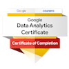

# Hello, I'm Baysan

I describe myself as a lifelong learner. I believe that I can learn everything if I want to learn. Therefore, I don't scare to join new challenges and try myself on new technologies and different project scales. Generally, I work on data-related projects. I help businesses to improve their Business Intelligence. I love and use open source tools to solve problems. I am not stubborn with any technologies. I use them to solve problems. I can work with all kinds of tools because I try to find the best tool for the kind of problem that I am trying to solve. Currently, I work as a business intelligence developer.

Also, I work at my own enterprise which I created while my intern age to serve the customers as a digital agency including web development, creating dashboards, integrating 3rd party applications to the customers' applications, or developing new 3rd party applications to create bridges between the customers' applications and other 3rd party applications. Also, I build business intelligence and data analytics infrastructures for clients. End-to-end data pipelines, custom ELT processes and analytics dashboards help to improve their businesses.

I am basically related to Data Analytics, Data Ethics, Machine Learning, and Artificial Intelligence topics. Nowadays, I use cloud technologies to improve my job. I also like meeting new people over a cup of coffee. I am always eager to challenges hards me. Feel free to reach out me at menesbaysan@gmail.com or DM me on LinkedIn.

Competencies: Learning How to Learn, Python, SQL, Web Development, Data Analysis, Data Visualization

Business Intelligence Developer | Data Engineer | Software Developer

# Tools

 

  

  
More...

  
  
  

 

 
