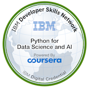

# Hello, I'm Baysan

Lifelong learner experienced Data Analyst who also has backend development experience. The entrepreneur created his own organization named BaysanSoft while his intern age. The main subjects which he related are Data Analytics, Data Ethics, Machine Learning, and Artificial Intelligence.

Freelancer at [BaysanSoft](https://www.baysansoft.com)

# Tools

 

  
More...

  
  
  

 

 